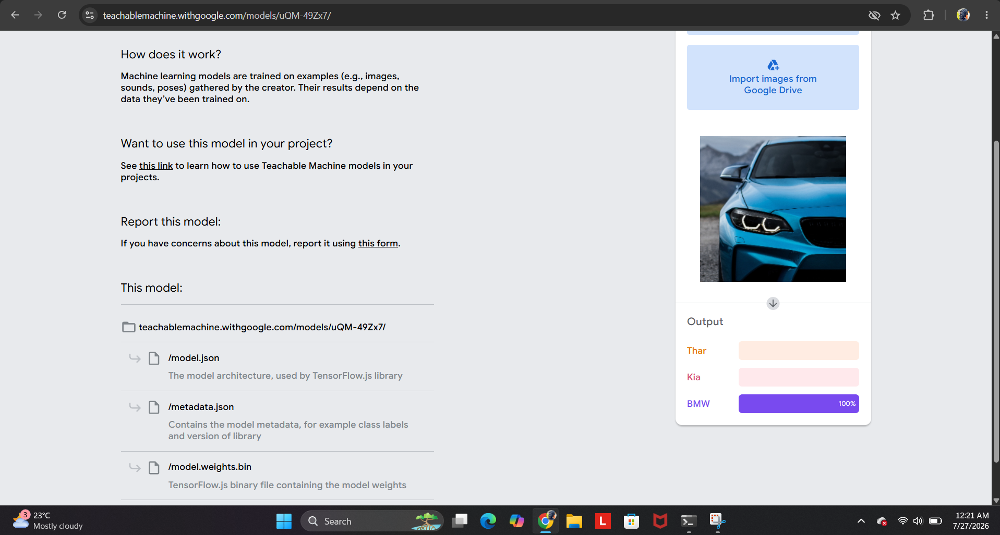

# 🚗 AI Car Classifier

This is a simple AI-based image classification project that identifies different car brands such as BMW, Kia, Toyota, etc. using a machine learning model.

## 🚀 Live Demo
Try the model here:  
https://teachablemachine.withgoogle.com/models/uQM-49Zx7/

---

## 🧠 About the Project
This project uses a machine learning image classification model to recognize different car brands from images in real time.

The model is trained using **Google Teachable Machine** and runs directly in the browser.

---

## 🏷️ Possible Classes
This model can be trained to classify:
- BMW
- Kia
- Audi
- Mercedes
- Toyota
- Tesla

(Depends on training data you provide)

---

## ✨ Features
- Real-time image prediction
- Browser-based AI (no installation required)
- Easy to train and customize
- Beginner-friendly ML project

---

## Output

### Real-time image prediction

---
## 🛠️ Tech Used
- Teachable Machine (Google)
- TensorFlow.js (under the hood)
- HTML / JavaScript (for web version)

---

## 📌 How It Works
1. Model is trained using images of cars
2. User opens live link
3. Camera detects car image
4. AI predicts the correct brand in real time

---

## 🔗 Links
- Live Model: https://teachablemachine.withgoogle.com/models/uQM-49Zx7/

---

## 👨‍💻 Author
Laxmi Sanas 

---

⭐ If you like this project, give the repository a star!

---

## 📷 Example Output
